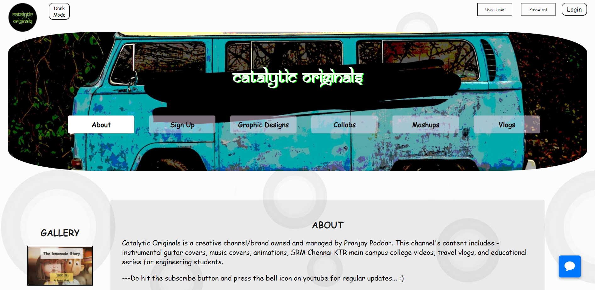
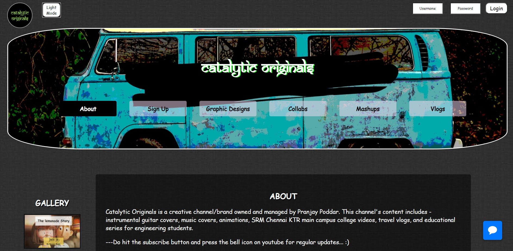

# catalytic_originals
This is the official website of catalytic originals!

https://catalyticoriginals.netlify.app/

Discription:
A vlogging channel's website with beautiful animations used in different sections, completely made using HTML5, CSS3, and Javascript. The first page consists of the home and about section followed by various other sections such as mashups, collabs signup, and graphic design that redirects to the particular youtube videos, signup nav redirects to a signup page for registration, and the graphic design redirects to an image gallery carousel. This website is available on both light and dark modes and is completely responsive hence compatible for viewing with mobile, tablets, and desktops.
 

  
  
  
  

  
  
  

   
  

  
  

   
  <h4 align="center">Light Mode:</h4>
  

  
  

   
  <h4 align="center">Dark Mode:</h4>
  

  
  

   
  <h4 align="center">Responsive For Std Sized Screens:</h4>
  

  
  

   
  
 ### MIT License

Copyright (c) 2021 Pranjay Poddar

Permission is hereby granted, free of charge, to any person obtaining a copy
of this software and associated documentation files (the "Software"), to deal
in the Software without restriction, including without limitation the rights
to use, copy, modify, merge, publish, distribute, sublicense, and/or sell
copies of the Software, and to permit persons to whom the Software is
furnished to do so, subject to the following conditions:

The above copyright notice and this permission notice shall be included in all
copies or substantial portions of the Software.

THE SOFTWARE IS PROVIDED "AS IS", WITHOUT WARRANTY OF ANY KIND, EXPRESS OR
IMPLIED, INCLUDING BUT NOT LIMITED TO THE WARRANTIES OF MERCHANTABILITY,
FITNESS FOR A PARTICULAR PURPOSE AND NONINFRINGEMENT. IN NO EVENT SHALL THE
AUTHORS OR COPYRIGHT HOLDERS BE LIABLE FOR ANY CLAIM, DAMAGES OR OTHER
LIABILITY, WHETHER IN AN ACTION OF CONTRACT, TORT OR OTHERWISE, ARISING FROM,
OUT OF OR IN CONNECTION WITH THE SOFTWARE OR THE USE OR OTHER DEALINGS IN THE
SOFTWARE.

  <h4 align="center">
   © Pranjay Poddar 2020
  </h4>

