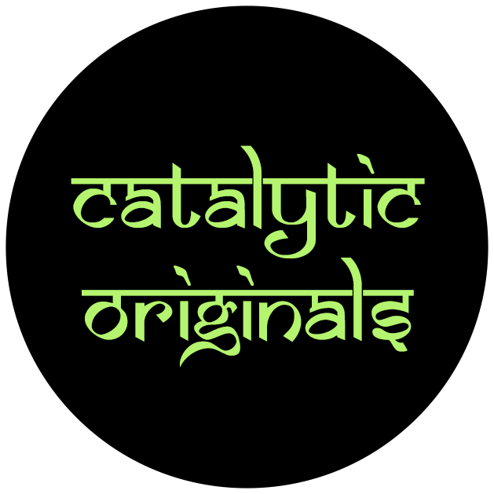
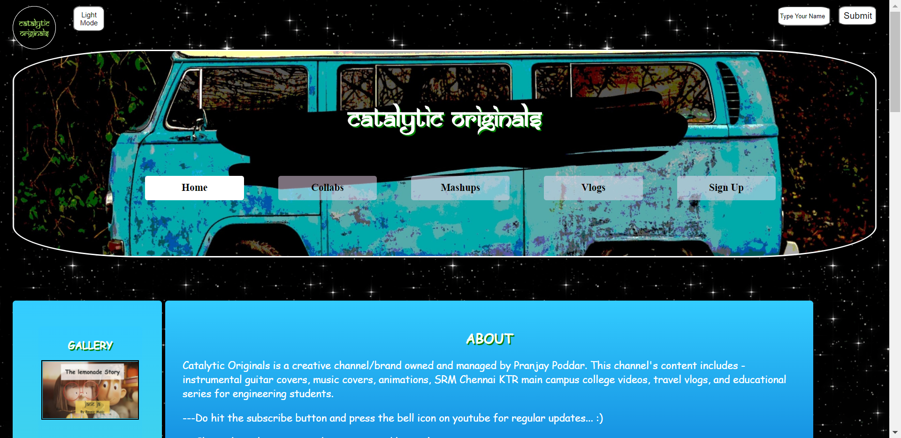

# catalytic_originals
This is the official website of catalytic originals!

https://pranjay-poddar.github.io/catalytic_originals/

Discription:
A vlogging channel's website with beautiful animations used in different sections, completely made using HTML5, CSS3, and Javascript. The first page consists of the home and about section followed by various other sections such as mashups, collabs signup, and graphic design that redirects to the particular youtube videos, signup nav redirects to a signup page for registration, and the graphic design redirects to an image gallery carousel. This website is available on both light and dark modes and is completely responsive hence compatible for viewing with mobile, tablets, and desktops.
 

  
  
  
  

  
  
  

   
  

  
  

   
  <h4 align="center">Light Mode:</h4>
  

  
  

   
  <h4 align="center">Dark Mode:</h4>
  

  
  

   
  <h4 align="center">Responsive For Std Sized Screens:</h4>
  

  
  

   
  <h4 align="center">
   ©Pranjay2020
  </h4>

